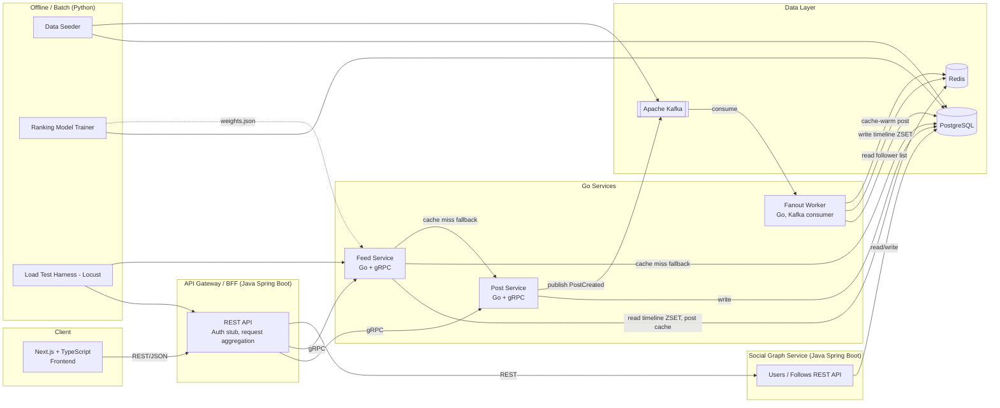
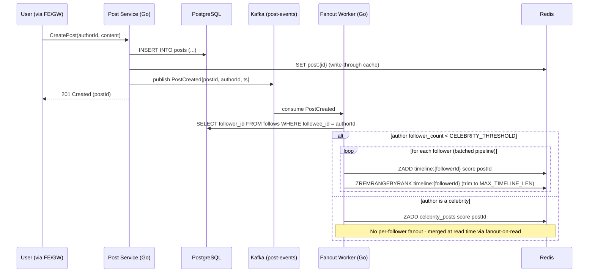
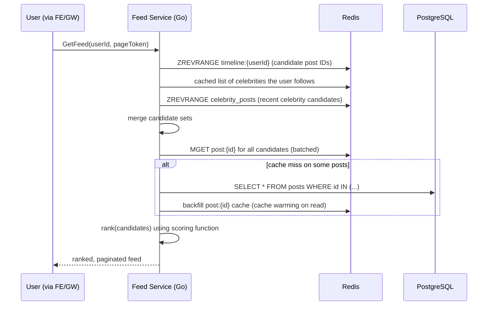

# Cascade — Real-Time Feed & Ranking System

## Implementation Plan v2.0 (finalized)

> Project: **Consumer Serving Infrastructure for Personalized Content Feeds**
> Repo: `cascade-feed-ranking-engine`
> Audience: undergraduate SWE learning project, portfolio/resume-grade, not production-grade.

This document is the single source of truth for building the project. It is organized so
you can work top-to-bottom, phase by phase, committing working software at the end of each
phase. Every phase has: goals, concrete tasks, API/schema sketches, and a "Definition of Done"
checklist.

**Status: finalized, ready to build.** All open design questions from v1.0 have been answered
by the project owner; see the **Decisions Log** (§19) for the final call on each and where it
changed the plan. Phase 0 can start immediately.

---

## 1. Project Goal & Framing

You are building the **serving infrastructure** behind a personalized feed — the part of
Instagram/X/LinkedIn that decides "what does this user see when they open the app, and how
fast can we get it to them." You are explicitly **not** building a social network's full
feature set (no DMs, stories, ads, comments UI polish, etc.). Every design decision should be
justified by one of these learning goals:

1. **Fanout-on-write vs fanout-on-read**, and a hybrid strategy for celebrity accounts.
2. **Caching layers** (Redis) that shield PostgreSQL from read-heavy traffic, including
   invalidation and warming strategies.
3. **Ranking infrastructure** — a scoring layer that reorders a candidate set instead of just
   returning it chronologically.
4. **Async, event-driven fanout** using Kafka, and the eventual-consistency tradeoffs that
   come with it.
5. **Latency-sensitive serving** via gRPC, with real, measured throughput/latency numbers
   under simulated load (Locust/Python), not invented ones.
6. **Polyglot service boundaries** — Go for the hot, low-latency read/write path; Java Spring
   Boot for the "slower-changing" social graph + BFF/gateway layer; Python for data
   generation, offline ranking-signal prep, and load testing; Next.js for the consumer-facing
   surface that makes the whole system demoable.

### 1.1 Target resume line (to validate, not assume)

> "Engineered a Go and gRPC fanout-on-write feed-ranking service generating personalized
> timelines for 50,000+ simulated users, then added a Redis caching layer that cut database
> read load 80% while sustaining 8,000+ requests/sec."

**Important:** Do not hardcode these numbers into the resume before you've measured them.
Phase 12 (Load Testing) exists specifically to *produce real numbers* from your own benchmark
runs on your own hardware. If your machine gets 3,000 req/s or 15,000 req/s, that's the number
that goes in the resume — the point of this plan is that the claim is earned and defensible in
an interview ("walk me through how you measured that 80%"), not that it matches this exact
sentence. See §13 for the exact benchmark methodology that produces defensible numbers.

---

## 2. High-Level Architecture



### 2.1 Write path (creating a post) — fanout-on-write



### 2.2 Read path (loading a feed)



---

## 3. Repository Layout (monorepo)

```
cascade-feed-ranking-engine/
├── IMPLEMENTATION_PLAN.md            (this file)
├── README.md
├── docs/
│   ├── architecture.md               (diagrams above, kept in sync)
│   ├── benchmarks/                   (dated benchmark result writeups)
│   └── decisions/                    (ADRs — see §14.1)
├── proto/                            (shared .proto contracts)
│   ├── post.proto
│   └── feed.proto
├── services/
│   ├── post-service/                 (Go)
│   ├── feed-service/                 (Go)
│   ├── fanout-worker/                (Go)
│   └── social-graph-service/         (Java Spring Boot)
├── gateway/                          (Java Spring Boot BFF)
├── ranking/                          (Python — offline model training)
├── loadtest/                        (Python — Locust + data seeding)
├── frontend/                        (Next.js + TypeScript)
├── deploy/
│   ├── docker-compose.yml
│   ├── docker-compose.override.dev.yml
│   └── k8s/                          (manifests / Helm chart, Phase 14)
├── migrations/                      (SQL migrations, tool: golang-migrate or Flyway)
└── scripts/                         (Makefile targets, proto codegen, seed wrappers)
```

A root `Makefile` should wrap the common commands (`make up`, `make proto`, `make seed`,
`make loadtest`, `make down`) so you don't have to remember `docker compose -f ... up` every
time. Add this in Phase 0.

---

## 4. Data Model (PostgreSQL)

```sql
-- Owned by Social Graph Service
CREATE TABLE users (
    id              BIGSERIAL PRIMARY KEY,
    username        TEXT UNIQUE NOT NULL,
    display_name    TEXT NOT NULL,
    is_celebrity    BOOLEAN NOT NULL DEFAULT FALSE, -- denormalized flag, recomputed by trigger/job
    follower_count  BIGINT NOT NULL DEFAULT 0,      -- denormalized, updated on follow/unfollow
    created_at      TIMESTAMPTZ NOT NULL DEFAULT now()
);

CREATE TABLE follows (
    follower_id     BIGINT NOT NULL REFERENCES users(id),
    followee_id     BIGINT NOT NULL REFERENCES users(id),
    created_at      TIMESTAMPTZ NOT NULL DEFAULT now(),
    PRIMARY KEY (follower_id, followee_id)
);
-- Critical index for fanout: "give me all followers of X"
CREATE INDEX idx_follows_followee ON follows(followee_id);
-- Critical index for read-time merge: "who does this user follow"
CREATE INDEX idx_follows_follower ON follows(follower_id);

-- Owned by Post Service
CREATE TABLE posts (
    id              BIGSERIAL PRIMARY KEY,
    author_id       BIGINT NOT NULL REFERENCES users(id),
    content         TEXT NOT NULL,
    media_url       TEXT,
    created_at      TIMESTAMPTZ NOT NULL DEFAULT now(),
    deleted_at      TIMESTAMPTZ            -- soft delete, see cache invalidation §7.4
);
CREATE INDEX idx_posts_author_created ON posts(author_id, created_at DESC);

-- Owned by Post Service (or a separate Engagement Service if you want to split further —
-- not required for the core resume story, but needed for the ranking signal in §8)
CREATE TABLE engagements (
    id              BIGSERIAL PRIMARY KEY,
    post_id         BIGINT NOT NULL REFERENCES posts(id),
    user_id         BIGINT NOT NULL REFERENCES users(id),
    type            TEXT NOT NULL CHECK (type IN ('like','comment','view','share')),
    created_at      TIMESTAMPTZ NOT NULL DEFAULT now()
);
CREATE INDEX idx_engagements_post ON engagements(post_id);
```

**Note on service DB ownership:** for undergrad scope, run one PostgreSQL instance with two
schemas (`social` and `content`) rather than two physical databases — this avoids
distributed-transaction problems while still teaching service *ownership* boundaries (each
service only queries its own schema; cross-schema needs go through an API call or an event).
The Fanout Worker is the one deliberate, temporary exception (§7.2) — scheduled to be removed
in Phase 9.5.

---

## 5. Service-by-Service Design

### 5.1 Post Service (Go, gRPC) — `services/post-service`

Owns: `posts` table. Responsibilities: create/read posts, write-through cache the post content
into Redis, publish `PostCreated`/`PostDeleted` events to Kafka.

`proto/post.proto` (sketch):

```protobuf
syntax = "proto3";
package cascade.post.v1;

service PostService {
  rpc CreatePost(CreatePostRequest) returns (CreatePostResponse);
  rpc GetPosts(GetPostsRequest) returns (GetPostsResponse); // batch hydrate, used by Feed Service
  rpc DeletePost(DeletePostRequest) returns (DeletePostResponse);
}

message CreatePostRequest {
  int64 author_id = 1;
  string content = 2;
  string media_url = 3;
}
message CreatePostResponse { int64 post_id = 1; int64 created_at_unix_ms = 2; }

message GetPostsRequest { repeated int64 post_ids = 1; }
message GetPostsResponse { repeated Post posts = 1; }

message Post {
  int64 id = 1;
  int64 author_id = 2;
  string content = 3;
  string media_url = 4;
  int64 created_at_unix_ms = 5;
}

message DeletePostRequest { int64 post_id = 1; int64 requesting_user_id = 2; }
message DeletePostResponse { bool ok = 1; }
```

Key implementation details:
- `CreatePost` is a single DB transaction: insert row → on commit, write `post:{id}` to Redis
  (write-through) → publish to Kafka **after** the DB commit succeeds (never publish before
  commit — otherwise fanout can run against a post that doesn't exist yet if the insert then
  fails). Use the **transactional outbox pattern** if you want to be rigorous about
  exactly-once publish semantics (stretch; see §9.1), otherwise a simple "commit then publish,
  log+alert on publish failure" is acceptable for this scope.
- `GetPosts` is what lets Feed Service batch-hydrate cache misses without an N+1 query pattern.

### 5.2 Social Graph Service (Java Spring Boot) — `services/social-graph-service`

Owns: `users`, `follows` tables. **Decision: REST only for core scope** — polyglot gRPC (a Go
client calling a Java gRPC server via `grpc-spring-boot-starter`) is explicitly a stretch goal,
not required, since the core learning value here is the Spring Boot CRUD/REST piece, not
Java-side gRPC. Endpoints:

```
POST   /users                          create a (simulated) user
GET    /users/{id}
POST   /follows                        { followerId, followeeId }
DELETE /follows/{followerId}/{followeeId}
GET    /users/{id}/followers?cursor=&limit=      paginated, used by Fanout Worker
GET    /users/{id}/following?cursor=&limit=      used by Feed Service for celebrity merge
GET    /internal/celebrities                     users above CELEBRITY_THRESHOLD, cached
```

Key implementation details:
- On every follow/unfollow, increment/decrement `users.follower_count` in the same
  transaction, and recompute `is_celebrity` if it crosses `CELEBRITY_THRESHOLD`.
- On follow, publish a `FollowCreated` Kafka event. This drives **cache warming**: the Fanout
  Worker consumes it and backfills the new follower's timeline with the followee's last N
  posts (otherwise a brand-new follow shows an empty gap until the followee's next post —
  a real bug in naive fanout-on-write systems, and a great thing to be able to talk about in
  an interview).
- Use Spring Data JPA + Flyway for migrations, Spring Web for REST, `spring-boot-starter-validation`
  for request validation. This is the more "enterprise CRUD" corner of the project — keep it
  simple and correct rather than clever.

### 5.3 Fanout Worker (Go) — `services/fanout-worker`

Not user-facing; a Kafka consumer group. Responsibilities:

1. Consume `post-events` topic.
2. On `PostCreated`: look up `follower_count` for `author_id` (cached in Redis, refreshed via
   `FollowCreated`/`FollowDeleted` events or short TTL).
   - If `follower_count < CELEBRITY_THRESHOLD` (config, default `10,000`): fetch full follower
     list, batch (e.g. 500 followers per Redis pipeline) `ZADD timeline:{followerId}` with
     `score = created_at_unix_ms` (or a ranking-adjusted score, see §8.3), then
     `ZREMRANGEBYRANK timeline:{followerId} 0 -(MAX_TIMELINE_LEN+1)` to bound memory.
   - Else: `ZADD celebrity_posts:global score postId` (a single small structure — this is the
     entire point of the hybrid strategy: an author with 10M followers costs the same fanout
     work as an author with 10 followers).
3. Consume `FollowCreated`: backfill the new relationship — fetch followee's last
   `BACKFILL_COUNT` (e.g. 20) posts from Redis/Postgres and `ZADD` them into the new follower's
   timeline (cache warming for new relationships).
4. Consume `PostDeleted`: cannot cheaply remove a single postId from every follower's ZSET at
   celebrity scale (that's a re-introduction of the fanout cost you were trying to avoid) — see
   §7.4 for the invalidation strategy (tombstone + filter-on-read).

Idempotency & reliability:
- Kafka delivery is at-least-once. Every handler must be idempotent: `ZADD` is naturally
  idempotent (re-adding the same member/score is a no-op change to state), which is a
  deliberate reason this design uses ZSETs instead of, say, list `LPUSH` (which is *not*
  idempotent and would duplicate posts on redelivery).
  - ❓ Flag for yourself in code comments where this matters — it's a great interview talking point.
- Use a consumer group with manual offset commit **after** successful Redis writes, and a
  dead-letter topic (`post-events.dlq`) for messages that fail repeatedly (e.g. malformed
  payload), so one bad message can't block the whole partition forever.
- Partition `post-events` by `author_id` so all events from one author are processed in order
  by one consumer instance — order matters for correct timeline ordering per author.

### 5.4 Feed Service (Go, gRPC) — `services/feed-service`

The read path. This is the service the load test in §13 will hammer, and the one whose
before/after cache numbers back the resume line.

```protobuf
syntax = "proto3";
package cascade.feed.v1;

service FeedService {
  rpc GetFeed(GetFeedRequest) returns (GetFeedResponse);
}

message GetFeedRequest {
  int64 user_id = 1;
  string page_token = 2;   // opaque cursor, e.g. base64(last_rank_score)
  int32 page_size = 3;     // default 20, max 100
}

message GetFeedResponse {
  repeated FeedItem items = 1;
  string next_page_token = 2;
}

message FeedItem {
  int64 post_id = 1;
  int64 author_id = 2;
  string content = 3;
  string media_url = 4;
  int64 created_at_unix_ms = 5;
  double rank_score = 6;
}
```

Request flow (matches §2.2 sequence diagram):
1. `ZREVRANGE timeline:{userId} 0 (offset+limit)` → candidate IDs from fanout-on-write cache.
2. `SMEMBERS following:celebrities:{userId}` (small, cached set) → which celebrities this user
   follows, then `ZREVRANGE celebrity_posts:global` filtered to that set (or a per-celebrity
   ZSET if you want O(1) filtering — evaluate at implementation time, flagged in §8.3).
3. Merge, dedupe, cap candidate set to e.g. 200 (ranking pool size).
4. `MGET post:{id1}, post:{id2}, ...` — batched, not one round trip per post (this is the
   single most important Redis performance lesson in the whole project: avoid N+1 Redis calls
   the same way you'd avoid N+1 SQL calls).
5. On cache miss (some IDs not found), call `PostService.GetPosts(missingIds)` → backfill
   `post:{id}` in Redis with a TTL (cache-aside pattern, complementing the write-through in
   Post Service — misses can happen if a Redis key evicted/expired, or if this is a fresh
   deploy with a cold cache).
6. Rank the merged, hydrated candidate set (§8).
7. Paginate, return `next_page_token`.

### 5.5 API Gateway / BFF (Java Spring Boot) — `gateway/`

The only service the frontend talks to directly. Responsibilities:
- Terminates HTTP/JSON from Next.js, translates to gRPC calls to Post/Feed Service and REST
  calls to Social Graph Service.
- Simple auth stub: a header (`X-User-Id`) or short-lived signed cookie identifying "which
  simulated user is this browser session acting as" — **not** real authentication. **Decision:
  confirmed out of scope** — a real auth flow (e.g. Spring Security + JWT) would not teach any
  of this project's core concepts (fanout, caching, ranking) and is not worth the time it would
  take away from those.
- Request aggregation: e.g. `GET /api/feed` calls Feed Service, then may need to call Social
  Graph Service to hydrate author display names/avatars if Feed Service only returns
  `author_id` (keep Feed Service's response lean — it's the hot path).
- This is also where you'd add rate limiting, request logging, and (stretch) response caching
  for anonymous/public views.

---

## 6. Kafka Design

| Topic | Key | Partitions (local) | Producer | Consumer(s) |
|---|---|---|---|---|
| `post-events` | `author_id` | 6 | Post Service | Fanout Worker |
| `follow-events` | `followee_id` | 6 | Social Graph Service | Fanout Worker |
| `post-events.dlq` | `author_id` | 3 | Fanout Worker (on failure) | manual inspection / replay tool |
| `engagement-events` (stretch, §8.4) | `post_id` | 6 | Gateway or Post Service | Ranking pipeline (Python, offline) |

Event schemas: **decision — plain JSON payloads**, confirmed for the full core scope (not just
a starting point). Protobuf/Avro + Schema Registry remains listed as a stretch goal only, since
it adds real setup cost for no core-lesson benefit here:

```json
// post-events
{ "eventType": "PostCreated", "postId": 123, "authorId": 45, "createdAtUnixMs": 1732400000000 }
{ "eventType": "PostDeleted", "postId": 123, "authorId": 45, "deletedAtUnixMs": 1732400500000 }

// follow-events
{ "eventType": "FollowCreated", "followerId": 9, "followeeId": 45, "createdAtUnixMs": 1732400000000 }
{ "eventType": "FollowDeleted", "followerId": 9, "followeeId": 45, "deletedAtUnixMs": 1732400500000 }
```

Local dev: **decision — real Apache Kafka, single Docker container, KRaft mode (no
ZooKeeper)**, via the official `apache/kafka` image (`apache/kafka:latest`, or pin a specific
version tag, e.g. `apache/kafka:3.8.0`). This matches the resume's "Apache Kafka" claim
literally, avoids running a separate ZooKeeper container, and is the standard way to run modern
(post-3.x) Kafka. Minimal single-node KRaft setup for `deploy/docker-compose.yml`:

```yaml
kafka:
  image: apache/kafka:3.8.0
  environment:
    KAFKA_NODE_ID: 1
    KAFKA_PROCESS_ROLES: broker,controller
    KAFKA_LISTENERS: PLAINTEXT://:9092,CONTROLLER://:9093
    KAFKA_ADVERTISED_LISTENERS: PLAINTEXT://kafka:9092
    KAFKA_CONTROLLER_LISTENER_NAMES: CONTROLLER
    KAFKA_CONTROLLER_QUORUM_VOTERS: 1@kafka:9093
    KAFKA_LISTENER_SECURITY_PROTOCOL_MAP: PLAINTEXT:PLAINTEXT,CONTROLLER:PLAINTEXT
    KAFKA_OFFSETS_TOPIC_REPLICATION_FACTOR: 1
    KAFKA_INTER_BROKER_LISTENER_NAME: PLAINTEXT
  ports:
    - "9092:9092"
```

Redpanda was considered as a lighter-weight, Kafka-API-compatible alternative but was rejected
for this project specifically because the resume claim is "Apache Kafka" — using the real thing
keeps that claim literally true and defensible in an interview.

---

## 7. Redis / Caching Design

### 7.1 Key schema

| Key pattern | Type | Written by | Read by | TTL | Purpose |
|---|---|---|---|---|---|
| `timeline:{userId}` | ZSET (member=postId, score=rank/time) | Fanout Worker | Feed Service | none (bounded by length, not time) | fanout-on-write cache |
| `celebrity_posts:global` | ZSET | Fanout Worker | Feed Service | none, capped length | fanout-on-read merge source |
| `post:{postId}` | HASH or JSON string | Post Service (write-through), Feed Service (cache-aside backfill) | Feed Service | e.g. 6h | avoid re-querying Postgres for content on every feed read |
| `followers:count:{userId}` | STRING (int) | Social Graph Service | Fanout Worker | short TTL or event-invalidated | avoid a DB round trip per post just to check celebrity status |
| `following:celebrities:{userId}` | SET | Social Graph Service (on follow/unfollow of a celebrity) | Feed Service | event-invalidated | O(1) "which celebrities does this user follow" for the read-time merge |
| `tombstones:{userId}` | SET (small, recent) | Post Service (on delete) | Feed Service | e.g. 24h | filter out deleted posts still sitting in ZSETs, see §7.4 |

### 7.2 Fanout-worker → Postgres access

The Fanout Worker needs follower lists at write time. Two implementation options — pick one
explicitly and write down why in an ADR (§14.1):

- **(a) Direct read of the `follows` table** (same Postgres instance, different schema). Fast,
  simple, no cross-service network hop in a latency-sensitive-ish batch path. Downside: breaks
  strict service ownership — the Fanout Worker (a "Go" concern) now has a dependency on the
  Social Graph Service's (a "Java" concern) schema shape.
- **(b) Call Social Graph Service's `GET /users/{id}/followers` REST endpoint**, paginated.
  Cleaner ownership boundary, easier to evolve the schema independently, but adds HTTP
  round-trips and makes the Fanout Worker's throughput depend on the Social Graph Service's
  availability/latency.

**Decision: start with (a), then deliberately refactor to (b) as its own scheduled task, not an
optional stretch goal.** Build the fanout pipeline against direct Postgres access first (Phase
5) so you can get the core fanout-on-write mechanics working end-to-end without a cross-service
dependency in the way. Once the Social Graph Service's REST API exists and is stable (after
Phase 9), come back and refactor the Fanout Worker to call
`GET /users/{id}/followers?cursor=&limit=` instead of querying `follows` directly. This is
scheduled explicitly as part of **Phase 9.5** (see the updated roadmap in §15) rather than left
as a someday-maybe stretch goal, because the *refactor itself* — identifying a shared-database
coupling and replacing it with a real service boundary, then re-measuring fanout throughput
before/after to confirm the added network hop didn't regress it unacceptably — is one of the
best, most concrete resume/interview stories in this whole project ("found and removed an
implicit coupling between two services that shared a database, and validated the fix didn't
hurt fanout latency"). Write the before/after comparison up as an ADR (§14.1).

### 7.3 Cache warming

Two distinct warming mechanisms, both worth implementing so you can talk about "warming" as
more than one thing in an interview:
1. **New-follow backfill** (§5.3.3): when someone follows a new account, don't wait for that
   account's next post — backfill recent history immediately.
2. **Cold-start / deploy warming** (optional script in `scripts/warm_cache.py` or a Go
   `cmd/warm-cache` binary): iterate active users (or all users, for a 50k-user demo dataset)
   and pre-populate `timeline:{userId}` from Postgres in a batch job, so a fresh Redis
   instance (e.g. after a restart with no persistence, or a benchmark reset between test runs)
   doesn't force every first request to hit Postgres. This is directly useful for producing
   clean, repeatable benchmark numbers in Phase 12.

### 7.4 Cache invalidation

- **Post edit:** simplest correct approach — posts are immutable in v1 (no edit feature). If
  you want edits as a stretch goal, invalidate `post:{id}` on edit (delete the key; next read
  repopulates via cache-aside) rather than trying to update it in place everywhere.
- **Post delete:** do **not** attempt to remove the postId from every follower's ZSET (that's
  the exact fanout cost you built the celebrity path to avoid). Instead: delete `post:{id}`
  from the content cache, add `postId` to `tombstones:{authorId's followers}`... actually
  simplest: maintain a single global small `tombstones` SET of recently-deleted post IDs (with
  a TTL long enough to outlast `MAX_TIMELINE_LEN` turnover), and have Feed Service filter any
  candidate ID present in `tombstones` before hydrating/ranking. This is a classic
  "soft-delete + filter-on-read" pattern.
- **Follow/unfollow:** invalidate `following:celebrities:{userId}` immediately (small set,
  cheap); do **not** try to retroactively remove/add the unfollowed/followed author's past
  posts from `timeline:{userId}` — feeds are allowed to be eventually consistent for a few
  seconds/minutes here, which is the tradeoff worth calling out explicitly (§9).

### 7.5 What "80% DB read reduction" actually measures

Instrument this precisely, don't estimate it: add a counter metric in Feed Service —
`feed_cache_hits_total` and `feed_postgres_fallback_total` (or `feed_db_queries_total`).
"80% reduction" should be phrased and measured as: *cache hit ratio on the hot read path*,
compared between "Redis disabled / cache-aside only against Postgres" mode and "Redis enabled"
mode, under the same simulated load. Phase 12 has the exact before/after protocol.

---

## 8. Ranking

### 8.1 v1: heuristic scoring (do this first, it's most of the learning value)

Score every candidate post at read time in Feed Service (in-process, no extra network hop —
ranking must not become the latency bottleneck):

```
score(post, viewer) =
      w_recency   * recency_decay(post.created_at)      // exponential decay, half-life ~ 6-12h
    + w_engagement * log1p(post.like_count + 2*post.comment_count)
    + w_affinity   * affinity(viewer, post.author)       // e.g. how often viewer engages w/ author
```

- `recency_decay(t) = exp(-(now - t) / half_life)`
- `affinity(viewer, author)`: precomputed periodically (a small offline batch job, could be
  the Python ranking module in §8.2) from the `engagements` table — e.g. "viewer's engagement
  rate with this author over the last 30 days," cached in Redis as `affinity:{viewerId}:{authorId}`
  with a default of a small constant for pairs with no history (cold start).
- Weights (`w_recency`, `w_engagement`, `w_affinity`) live in a config file, hot-reloadable
  ideally, so you can demo "turning the ranking knobs" live without a redeploy.
- Log the score breakdown per request behind a debug flag — useful for the frontend's
  "why am I seeing this post" debug view (nice demo feature, §10 item 2).

### 8.2 v2 (explicitly out of core scope — not this project's intent)

**Decision: not part of the core project.** The heuristic scoring in §8.1 is the intended
final state of the ranking layer — this project is about *ranking infrastructure* (candidate
generation, merging, applying a scoring function fast, at read time), not about building a good
ML model. The subsection below is kept only as an optional stretch idea if you finish
everything else and specifically want ML practice later; skip it entirely for the core build.

If you ever do pick this up, treat it as an **offline** step, not an online service call
(keeping Python out of the hot path preserves your latency numbers):
1. `ranking/generate_synthetic_engagements.py`: since there's no real user behavior, generate
   plausible synthetic engagement data with intentional signal (e.g. users engage more with
   recent posts, more with authors they already engage with, engagement decays with content
   age) — label this clearly as synthetic in the code and docs.
2. `ranking/train_model.py`: fit a small logistic regression (scikit-learn) predicting
   `P(engage | recency, author_affinity, post_length, ...)`.
3. Export learned coefficients to `ranking/weights.json`.
4. Feed Service loads `weights.json` at startup (or via a config reload endpoint) and uses the
   learned weights in the same linear-combination formula from §8.1 — i.e., the *offline*
   Python step decides the weights, the *online* Go step still just does a fast dot product.

This is the realistic industry pattern (train offline, serve a cheap function of the model
online) and is worth doing specifically because it teaches that distinction, not because the
model itself needs to be good.

### 8.3 Open implementation detail: score consistency between fanout-write and read-time rank

If `timeline:{userId}` is sorted by `created_at` (simple, chronological — good enough for a
first version) versus sorted by a precomputed rank score (requires recomputing/re-sorting the
ZSET as engagement/affinity signals change, which is much harder to do at fanout-write time) —
**recommendation:** keep the ZSET sorted by `created_at` (cheap, stable) and do ranking
*only* at read time over the candidate pool pulled from that ZSET. Don't try to make the
write-time fanout "rank-aware" — that's a substantially harder distributed-systems problem
(constantly re-scoring millions of cached entries) that isn't worth the complexity for this
project's scope.

### 8.4 Engagement events (stretch)

If you want real (synthetic-but-live) signal instead of only batch-generated data: add
"like"/"view" endpoints in the Gateway, publish to `engagement-events`, and have a small
consumer update `engagements` table + refresh `affinity:{viewer}:{author}` in Redis. This closes
the loop: user interacts in the demo frontend → ranking actually changes.

---

## 9. Consistency & Failure Handling

This project deliberately embraces **eventual consistency** on the write→fanout path (that's
the whole point of doing fanout asynchronously via Kafka rather than synchronously in the
`CreatePost` request). Write this down explicitly and be ready to explain the tradeoffs:

- **What's eventually consistent:** how quickly a new post appears in followers' feeds
  (bounded by Kafka consumer lag + fanout processing time — measure and log this as a metric:
  `fanout_lag_ms` from `PostCreated` publish time to Redis write completion).
- **What's strongly consistent:** the post itself, once created, is immediately readable via
  `GetPost`/`GetPosts` directly from Postgres/cache — the *author* always sees their own post
  immediately (a real product requirement in every feed system: "read your own writes").
  Implement this explicitly: after `CreatePost`, the Gateway can optimistically prepend the new
  post to the response it returns to the *author's own* immediate feed view client-side, or
  Feed Service can special-case "always include the viewer's own posts newer than
  their timeline's most recent fanned-out entry" — pick one and document it.
- **Failure modes to handle explicitly** (implement + write a short note on each in
  `docs/architecture.md`):
  1. Kafka consumer crashes mid-batch → at-least-once redelivery → idempotent `ZADD` (§5.3).
  2. Redis is down/unreachable when Feed Service tries to read → fall back to a
     "degraded mode" that serves a reverse-chronological query directly from Postgres
     (slow but correct) rather than a 500 error. This is a great thing to implement and
     demo: kill the Redis container mid-benchmark and show the system degrade gracefully
     instead of falling over.
  3. Post Service commits to Postgres but crashes before publishing to Kafka → post exists but
     never gets fanned out. Mitigate with the transactional outbox pattern (stretch, §9.1) or,
     minimally, a periodic reconciliation job that finds posts with no corresponding fanout
     record and re-publishes.
  4. Fanout Worker falls behind (consumer lag grows) under a burst of celebrity/viral activity
     → expose Kafka consumer lag as a metric, and in Phase 14 demo horizontal scaling
     (more consumer instances = more partitions consumed in parallel = lag recovers).

### 9.1 Transactional outbox (stretch)

Instead of "commit to Postgres, then publish to Kafka" (two separate operations that can fail
independently), write the event into an `outbox` table in the *same transaction* as the post
insert, then have a small separate poller (or Debezium/CDC, likely overkill for this scope)
read the outbox table and publish to Kafka, marking rows as published. Guarantees the event is
never lost even if the process crashes right after the DB commit. Good to know about; only
implement it if Phase 5/9 feel too easy and you want the extra rigor.

---

## 10. Frontend (Next.js + TypeScript) — `frontend/`

Purpose: make the system *demoable*, and give you a way to visually validate ranking/caching
behavior, not to be a polished consumer product.

Pages/components:
1. **User switcher** (top bar dropdown): pick which of the seeded simulated users you're
   "logged in as." Sets the `X-User-Id` header/cookie the Gateway reads.
2. **Home feed** (`/feed`): infinite-scroll list calling `GET /api/feed?cursor=`, rendering
   `content`, `authorDisplayName`, relative timestamp, and (debug toggle) the raw rank score
   and its component breakdown from §8.1.
3. **Composer**: text box → `POST /api/posts`. On success, optimistically show it at the top of
   your own feed immediately (ties into §9's "read your own writes" behavior) with a small
   "fanning out…" indicator that resolves once you refresh and see it appear for a *different*
   simulated user too (great live demo of async fanout).
4. **Follow graph explorer**: simple page to follow/unfollow other simulated users, and see
   your follower/following counts update.
5. **Admin/metrics dashboard** (`/admin`): pulls from a metrics endpoint (§11) to show, live:
   cache hit ratio, p50/p95/p99 feed latency, requests/sec, Kafka consumer lag. This page is
   what makes your resume numbers *visually demonstrable* rather than just a claim in a
   markdown file — screenshot/record this for your portfolio.

Tech notes: Next.js App Router, TypeScript throughout, a thin typed API client
(`frontend/lib/api.ts`) hitting the Gateway's REST endpoints (no gRPC-Web needed — the Gateway
already translates gRPC↔REST for you, which is one of the reasons it exists). Use
`@tanstack/react-query` for data fetching/caching in the UI (a nice parallel lesson: client-side
caching mirrors the same "reduce redundant reads" idea as the Redis layer, worth calling out).

---

## 11. Observability

Minimum viable (do this, it's cheap and pays for itself in every later debugging session):
- **Structured logs** (JSON) in every service, with a `request_id`/`trace_id` propagated from
  Gateway → Feed/Post Service via a gRPC metadata header, so you can grep one request's full
  path across services.
- **Metrics** via Prometheus client libraries (`client_golang`, Spring Boot Actuator +
  Micrometer for Java): expose `/metrics` on every service. Key metrics to define from day one
  (retrofitting metrics later is annoying):
  - `feed_request_duration_seconds` (histogram, labeled by cache_hit=true/false)
  - `feed_cache_hit_ratio` (or derive from hit/miss counters)
  - `fanout_events_processed_total`, `fanout_lag_ms`
  - `kafka_consumer_lag` (per topic/partition)
  - `grpc_server_handled_total` / `_duration_seconds` (standard gRPC interceptor metrics)
- **Dashboards**: Prometheus + Grafana via Docker Compose, one dashboard = one screenshot for
  your portfolio showing p95 latency and req/sec during a load test.
- (Stretch) **Tracing**: OpenTelemetry across Gateway → Feed Service → Redis/Postgres calls,
  viewed in Jaeger. Valuable but the highest-effort/lowest-incremental-learning item on this
  list for this project's scope — do it last if at all.

---

## 12. Containerization & Local Orchestration (Docker)

`deploy/docker-compose.yml` services: `postgres`, `redis`, `kafka` (KRaft mode, single node),
`post-service`, `feed-service`, `fanout-worker`, `social-graph-service`, `gateway`, `frontend`,
`prometheus`, `grafana`. Use Compose `healthcheck` + `depends_on: condition: service_healthy`
so services don't crash-loop against a Postgres/Kafka that isn't ready yet — this is a common
early-project pain point, solve it once in Phase 0/13 and forget about it.

Each Go/Java service gets a multi-stage Dockerfile (build stage with full toolchain → slim
runtime image, e.g. `distroless` or `alpine` for Go, a JRE-only base for the Spring Boot jars)
to keep images small — worth doing correctly since it directly matters once you get to
Kubernetes resource limits in Phase 14.

---

## 13. Load Testing & Benchmarking (Python) — `loadtest/`

This phase is what makes the resume line true. Follow this protocol precisely and save the
raw output — you'll want to link/quote it later.

### 13.1 Data seeding (`loadtest/seed.py`)

- Generate **50,000 simulated users**.
- Generate a **follow graph with a power-law/Zipfian degree distribution** (most users follow
  ~50-300 accounts; a small number of "celebrity" accounts have 10,000-40,000 followers) — a
  uniform-random graph won't exercise the celebrity/hybrid-fanout code path at all, which
  defeats the point of having built it.
- Generate an initial batch of posts (e.g. 5-10 per user) so timelines aren't empty before the
  load test starts, then run cache-warming (§7.3.2).
- Use `asyncpg`/`psycopg` with batched `COPY`/`executemany` inserts — a naive per-row insert
  loop for 50k users + their follow edges will itself take embarrassingly long and is worth
  avoiding.

### 13.2 Benchmark harness (`loadtest/locustfile.py`, or a raw `asyncio` + `aiohttp`/gRPC client
script if you prefer more control than Locust gives you)

- Primary scenario: simulate concurrent users repeatedly calling `GetFeed` (weighted much
  higher than `CreatePost`, matching a realistic read-heavy ratio, e.g. 100:1 or so — state
  your assumed ratio explicitly in the write-up).
- Ramp concurrency up (e.g. Locust's user-spawn-rate) until p99 latency crosses a threshold you
  define upfront (e.g. 200ms) or error rate rises — that inflection point, not just a single
  fixed-concurrency run, is what "sustaining N req/sec" should mean.

### 13.3 The before/after comparison that produces the cache-reduction number

Run the **exact same** seeded dataset and the **exact same** load profile twice:
1. **Baseline:** Feed Service configured with Redis caching disabled/bypassed (candidate
   fetch + post hydration goes straight to Postgres every time). Record: requests/sec at your
   latency threshold, Postgres query count/sec (from `pg_stat_statements` or a query counter
   metric), p50/p95/p99 latency.
2. **With cache:** same run, Redis enabled. Record the same metrics.
3. **Cache hit reduction = 1 − (Postgres queries/sec with cache ÷ Postgres queries/sec baseline)**,
   reported as a percentage. This is the number that maps to "cut database read load 80%" —
   whatever your measured value actually is.
4. Save both runs' raw Locust output (CSV/HTML report) plus a short Markdown write-up under
   `docs/benchmarks/YYYY-MM-DD-cache-comparison.md` with your machine specs (container CPU/mem
   limits matter a lot here — state them) so the numbers are reproducible and explainable.

### 13.4 What "8,000+ requests/sec" should actually mean

State explicitly, in the same benchmark write-up: number of Feed Service instances running,
CPU/memory allocated to each, whether the number is aggregate across instances or per
instance, and the latency threshold you held while measuring throughput (throughput numbers
without a latency bound are close to meaningless — "8,000 req/s at 4-second p99 latency" is not
a good result). This level of precision is exactly what turns a resume bullet into something
you can confidently defend for 10 minutes in an interview.

---

## 14. Kubernetes (local only, do last) — `deploy/k8s/`

**Decision: local `kind`/`minikube` only — no managed cloud Kubernetes (EKS/GKE/AKS), and no
cloud deployment of any kind for this project.** Kubernetes here is purely a
deployment/scaling **learning exercise run entirely on your own machine**, not infrastructure
the core project depends on, and not something that should incur any cloud cost. Suggested
scope:
- A Deployment + Service per microservice, ConfigMaps for the ranking weights/celebrity
  threshold, Secrets for DB credentials.
- A `HorizontalPodAutoscaler` on Feed Service keyed on CPU (or, better, a custom metric like
  `feed_request_duration_seconds` p95 via Prometheus Adapter if you want to go further) — then
  re-run the Phase 13 load test against the k8s deployment and demo pods scaling up under load
  in real time (`kubectl get hpa -w`). This directly reinforces "handle celebrity-scale traffic
  patterns" as an *operational*, not just algorithmic, concern.
- (Optional) a small chaos test: `kubectl delete pod <feed-service-pod>` mid-load-test and
  confirm the Service routes around it with only a brief blip — ties back to §9's failure
  handling discussion.

### 14.1 ADRs (Architecture Decision Records) — `docs/decisions/`

Keep one short markdown file per significant decision (fanout threshold, ZSET vs sorted list
schema, direct-DB-access vs REST for the fanout worker, Kafka vs Redpanda, etc.), format:
Context → Decision → Consequences. This is a lightweight habit that pays off enormously when
you're explaining the project months later in an interview, and it's a good artifact to point
to as evidence of deliberate engineering, not just "made it work."

---

## 15. Phased Roadmap & Definition of Done

Work through phases in order; each should end in a commit with passing tests for that phase.
Complexity/dependency notes replace calendar estimates (per project convention: this is about
sequencing and risk, not a schedule).

| # | Phase | Depends on | Complexity | Definition of Done |
|---|---|---|---|---|
| 0 | Repo bootstrap: monorepo skeleton, Makefile, CI (lint+test on push), proto codegen setup | — | Low | `make proto` generates Go+Java stubs from `proto/*.proto`; CI green on empty services |
| 1 | Postgres schema + migrations | 0 | Low | `migrations/` applies cleanly to a fresh DB; ERD in `docs/architecture.md` matches §4 |
| 2 | Social Graph Service (Spring Boot) | 1 | Medium | CRUD + follow/unfollow REST endpoints pass integration tests (Testcontainers Postgres); follower_count/is_celebrity maintained correctly |
| 3 | Post Service (Go, gRPC) | 1 | Medium | `CreatePost`/`GetPosts`/`DeletePost` work against real Postgres; write-through Redis cache verified; Kafka publish verified with a local consumer |
| 4 | Kafka backbone wired up in Compose | 0 | Low-Medium | topics auto-created or created via init script; a throwaway consumer script proves messages flow end-to-end |
| 5 | Fanout Worker: fanout-on-write + celebrity hybrid | 2,3,4 | High | Creating a post from a non-celebrity author populates all followers' `timeline:{id}` ZSETs; creating a post from a celebrity author populates only `celebrity_posts:global`; idempotency verified by redelivering the same Kafka message twice and confirming no duplicate/inconsistent state |
| 6 | Feed Service: read path, merge, pagination | 5 | High | `GetFeed` returns correctly merged/paginated chronological results for both celebrity-followers and non-celebrity-followers; cache-miss fallback to Post Service verified by manually evicting a `post:{id}` key |
| 7 | Ranking v1 (heuristic) | 6 | Medium | Reordering is visibly different from pure chronological on a dataset with varied engagement counts; weights configurable without code changes |
| 8 | Cache invalidation + warming (tombstones, new-follow backfill, cold-start warm script) | 5,6 | Medium | Deleting a post makes it disappear from feeds within one read cycle; a brand-new follow immediately shows the followee's recent posts |
| 9 | Gateway/BFF (Spring Boot) + auth stub | 3,6,2 | Medium | Frontend can hit one base URL for everything; `X-User-Id` correctly threads through to per-user feed/personalization |
| 9.5 | **Service-boundary refactor:** Fanout Worker switches from direct `follows` table access to calling Social Graph Service's paginated `/users/{id}/followers` REST endpoint (§7.2) | 5,9 | Medium | Fanout Worker no longer holds a DB connection/credentials for the `social` schema; fanout throughput re-measured post-refactor and compared to pre-refactor baseline; ADR written under `docs/decisions/` documenting the before/after |
| 10 | Frontend (Next.js) | 9 | Medium | Can create a post as User A, switch to User B (a follower), and see it appear after a short delay; admin metrics page renders live numbers |
| 11 | Observability (Prometheus/Grafana, structured logs, request IDs) | 3,5,6,9 | Medium | Grafana dashboard shows live req/sec + latency percentiles during a manual burst of requests |
| 12 | Load testing & benchmarking (Python/Locust) | 6,8,11 | High | Reproducible before/after cache benchmark write-up committed under `docs/benchmarks/`, with real measured numbers |
| 13 | Full Docker Compose integration ("one command up") | all above | Low-Medium | `make up` brings up the entire stack from a clean checkout; smoke test script exercises create-post → fanout → feed-read end to end |
| 14 | Kubernetes on a local `kind` cluster only — **no cloud deployment** | 13 | High | Same smoke test passes against a local `kind` cluster; HPA scales Feed Service replicas observably under the Phase 12 load profile; no managed cloud k8s (EKS/GKE/AKS) is provisioned, and this phase incurs no cloud cost |
| 15 | Hardening: unit/integration test coverage pass, ADRs written, final README + architecture doc polish, capture final resume numbers | 9.5,12,13 | Medium | README explains how to run everything and links the final benchmark write-up; resume bullet updated with your own measured numbers |

Stretch goals (do only if the above feels solid and you want more): transactional outbox
(§9.1), Protobuf/Avro + Schema Registry for Kafka payloads, real engagement-driven affinity
(§8.4), OpenTelemetry tracing, an ML-trained ranking model (§8.2 — explicitly deprioritized per
project owner; not the intended focus of this project), gRPC on Social Graph Service (§5.2),
and chaos testing in k8s (§14).

---

## 16. Testing Strategy (applies across phases)

- **Go services:** table-driven unit tests for scoring/merging/pagination logic;
  integration tests using `testcontainers-go` to spin up real Postgres/Redis/Kafka for
  Fanout Worker and Feed Service tests — these are the tests that actually catch fanout bugs,
  don't rely on mocks alone for this part.
- **Java service:** Spring Boot `@SpringBootTest` + Testcontainers Postgres for repository/
  controller integration tests.
- **Cross-service smoke test** (`scripts/smoke_test.py` or a Go integration test in
  `services/`): create a user, create a post, wait for fanout, assert it appears in a
  follower's `GetFeed` response — this is your regression safety net once all pieces exist and
  the single most valuable test in the repo.
- **Load test as a test, not just a demo:** consider asserting a latency/error-rate budget in
  CI on a small synthetic dataset (e.g. 500 users) as a lightweight perf-regression guard,
  separate from the full 50k-user benchmark you run manually for the resume numbers.

---

## 17. Security Considerations (kept intentionally minimal, but explicit)

This is not a production system and should not pretend to be one — but say so explicitly
rather than silently skipping security, since "here's what I deliberately scoped out and why"
is itself a good engineering statement:
- No real authentication/authorization (confirmed decision — see §19) — the `X-User-Id` header
  is trivially spoofable by design, for demo convenience. Document this loudly in the README.
- Basic input validation on all public endpoints (content length limits, required fields) to
  avoid the demo breaking on garbage input, not as a security boundary.
- Don't commit real secrets; use `.env` files (git-ignored) + `.env.example` committed, and
  Kubernetes Secrets (not ConfigMaps) for credentials in Phase 14.
- Rate limiting at the Gateway (simple token bucket per `X-User-Id`) is a nice, cheap addition
  that also protects your load test infrastructure from itself.

---

## 18. Glossary (for your own README/interview prep)

- **Fanout-on-write:** push new content into every follower's precomputed feed cache at write
  time. Fast reads, expensive/wasteful writes for high-follower-count authors.
- **Fanout-on-read:** compute the feed by merging sources at read time. Cheap writes, expensive
  reads (must query across everyone you follow every time).
- **Hybrid fanout:** fanout-on-write for normal accounts, fanout-on-read for celebrity accounts
  — the industry-standard compromise this project implements.
- **Read/write amplification:** how much extra read or write work one logical operation
  triggers (one post from a celebrity → one write, vs. one post from a normal user → N writes,
  one per follower).
- **Cache warming:** proactively populating a cache before it's needed, rather than waiting for
  organic cache misses to populate it (cold-start warming, new-relationship backfill).
- **Eventual consistency:** the system converges to a correct state, but not instantaneously —
  here, "converges" means "the post shows up in followers' feeds within the fanout worker's
  processing latency," not "immediately."

---

## 19. Decisions Log

All open questions from v1.0 of this plan have been answered by the project owner. This is the
final record of each call and where it's reflected in the plan above. **No further decisions
are pending — the plan is finalized and ready to build starting at Phase 0.**

| # | Question | Decision | Where it's reflected |
|---|---|---|---|
| 1 | Kafka vs Redpanda for local dev | **Real Apache Kafka**, single Docker container, KRaft mode, no ZooKeeper | §6 (topic table + Compose snippet) |
| 2 | Should Social Graph Service (Java) expose gRPC, or REST only? | **REST only for core scope.** Polyglot gRPC (Go client → Java gRPC server) is a stretch goal only | §5.2, §15 stretch goals |
| 3 | Fanout Worker's data access pattern | **Start with direct Postgres access (Phase 5); explicitly refactor to a REST call against Social Graph Service as its own scheduled task (Phase 9.5)**, not left as an optional someday-maybe stretch goal | §7.2, §15 roadmap (Phase 9.5) |
| 4 | Auth scope | **Confirmed out of core scope.** Spoofable `X-User-Id` header/cookie "user switcher," no real authentication | §5.5, §17 |
| 5 | Ranking model depth (ML) | **Confirmed out of core scope — not the intent of this project.** Heuristic scoring (§8.1) is the final state of the ranking layer; the Python-trained model (§8.2) is kept only as an optional idea for later, unscheduled | §8.2, §15 stretch goals |
| 6 | Kubernetes / cloud deployment | **Local `kind`/`minikube` only. No managed cloud Kubernetes, no cloud deployment of any kind, no cloud cost.** | §14, §15 (Phase 14) |
| 7 | Resume numbers | **Confirmed.** Phase 12-13's benchmark protocol produces the real numbers that go into the resume bullet — not pre-set targets to engineer toward | §1.1, §13 |
| 8 | Schema Registry / Protobuf-on-Kafka | **Plain JSON event payloads for the full core scope**, not just a starting point. Binary schemas remain a stretch goal only | §6 |

Nothing above blocks starting Phase 0 immediately.
